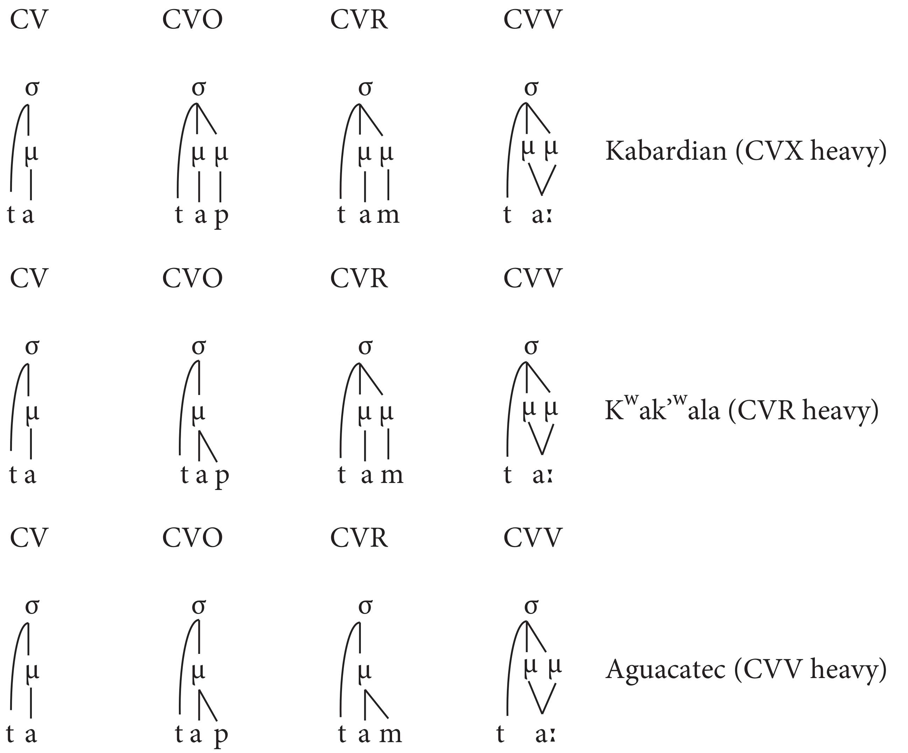

# Word-prosodic units

## Suprasegmentals

We spent a lot of time talking about segmental level of a language (vowel and consonants). In this chapter we will try to grasp some suprasegmental features that superimposed on the syllable level or even word level. Here is the list of some suprasegmental units:

- stress
- tone
- intonation
- rhythm
- pauses

## Stress

Stress refers to greater prominence associated with certain syllables in a word and can be manifested with 

- increased duration
- higher fundamental frequency
- increased intensity

Descriptive typology of stress:

- predictable stress
  - structure of syllables (“weight-sensitive”)
    - Hierarchy of weight for nucleus: Low V > Mid V > High V > Central V (after [@gordon07])
    - Hierarchy of weight for rime: VVC > VV > VR > VO > V (after [@gordon07])
  - location of syllable in a word (“weight-insensitive”)
- lexically/morphologically motivated

Weight-sensitive systems led to the creation of Moraic Theory [@hyman85], based on [@gordon16]:

There is a list of works in [@gordon16] that provide some phonetic underpinnings of syllable weight [@broselow97; @ahn00; @gordon02; @gordon05; @gordon05; @ryan14]. 