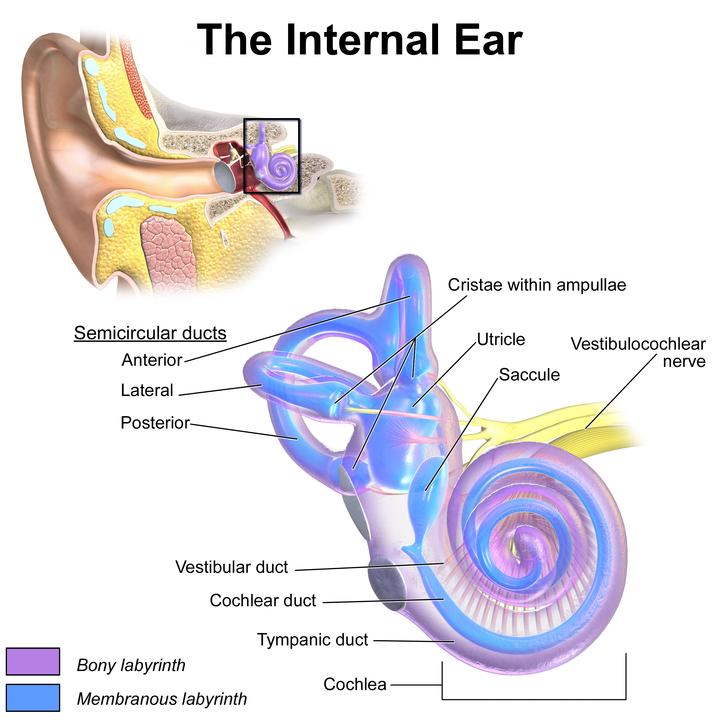
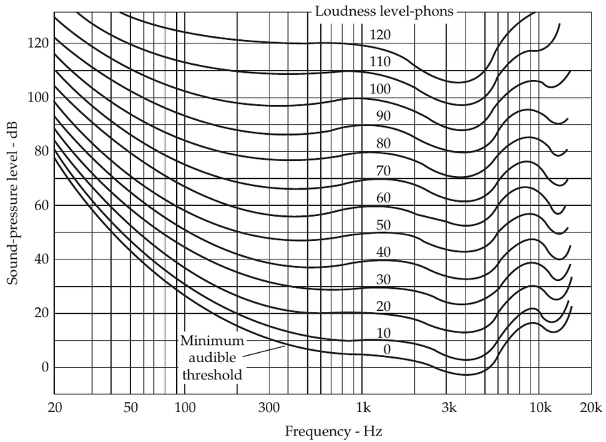

```{r setup10, include=FALSE}
options(digits = 3)
knitr::opts_chunk$set(echo = FALSE, warning = FALSE, message = FALSE)
library(tidyverse)
theme_set(theme_bw()+theme(text = element_text(size=18)))
```

# Speech perception

This lecture [was recorded](https://youtu.be/LEVN7V9Fiis).

During the course we almost completely was focused on a Acoustic Phonetics ignoring Articulatory and Auditory Phonetics. Auditory phonetics focuses on

* hearing of speech signals;
* perception of speech signals.

## Hearing

During the hearing acoustic waves are transformed into nerve impulses that are perceived by the brain. This process is described in this [Wikipedia video](https://commons.wikimedia.org/w/index.php?title=File%3AJourney_of_Sound_to_the_Brain.ogv).

```{r, fig.cap='Blausen.com staff (2014). "Medical gallery of Blausen Medical 2014". WikiJournal of Medicine 1 (2). DOI:10.15347/wjm/2014.010. ISSN 2002-4436'}

```

The peripheral auditory system

* translates acoustic signals into neural signals;
* performs amplitude compression;
* performs a kind of Fourier analysis.

## Perception of speech signals

There is no one to one connections between physical properties of sounds and their auditory sensations. However during the experiments we can reveal how they are connected:

* amplitude or intensity --- loudness;
* fundamental frequency --- pitch;
* spectral structure --- sound quality;
* duration -- length.

### Non-acoustic factors influencing perception

People use a lot of different things in order to decode what have been said:

* context;
  * when part of an utterance is replaced by another sound (e.g. white noise), listeners perceptually restore the missing speech. [@warren70; @samuel81; and many others];
* knowledge of linguistic units (Ganong effect, [@ganong80]); and their frequency?..
* visual signal: [McGurk Effect](https://www.youtube.com/watch?v=PWGeUztTkRA).

### Psychoacoustic scales

An equal-loudness contour [@fletcher33] is a measure of sound pressure level, over the frequency spectrum, for which a listener perceives a constant loudness when presented with pure steady tones.

```{r, fig.cap="Manoochehr Darvish, 2015, DOI:10.14279/depositonce-4409"}

```

Loudness historically was described with **sone** and **phone** scales, but the most popular now is A-weighting:

```{r}
tibble(x = c(6.3, 8, 10, 12.5, 16, 20, 25, 31.5, 40, 50, 63, 80, 100, 125, 160, 200, 250, 315, 400, 500, 630, 800, 1000, 1250, 1600, 2000, 2500, 3150, 4000, 5000, 6300, 8000, 10000, 12500, 16000, 20000),
       y = c(-85.4, -77.6, -70.4, -63.6, -56.4, -50.4, -44.8, -39.5, -34.5, -30.3, -26.2, -22.4, -19.1, -16.2, -13.2, -10.8, -8.7, -6.6, -4.8, -3.2, -1.9, -0.8, 0, 0.6, 1, 1.2, 1.3, 1.2, 1, 0.6, -0.1, -1.1, -2.5, -4.3, -6.7, -9.3)) %>% 
  ggplot(aes(x, y))+
  geom_line()+
  scale_x_log10()+
  labs(x = "Frequency (Hz), log-scale",
       y = "Gain (Db)",
       title = "A-weighting curve")
```

The same idea for perception of frequency if proposed in Bark scales:

```{r}
tibble(f = 1:1e4,
       #bark = 13*atan(f)+3.5*atan((f/7500)^2),
       bark = (26.81*f)/(1960+f)-0.53) %>% 
  ggplot(aes(bark, f))+
  geom_line()+
  scale_y_log10()+
  labs(y = "Frequency (Hz), log-scale",
       x = "bark")
```


### Categorical perception

https://www.youtube.com/watch?v=yd9Z4dZ1OSs